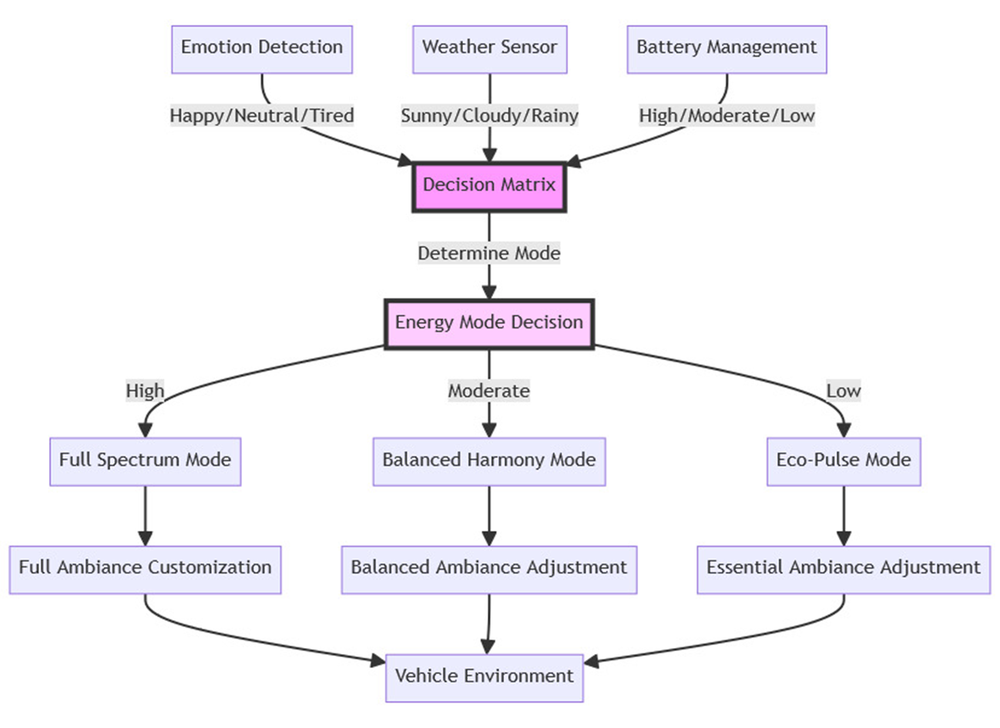

# SofDCar Hackathon 2023
## JARVIZ

We built JARVIZ, it is an external and internal vehicle assistance system. The external assistance is controlled with intuitive voice command powered by wit.ai. The vehicle performs actions such as opening the door for single and multiple passengers, opens the trunk and many more. The commands are intuitive and not robotic. 

```
Human: Hey Mercedes, I have my luggage in my hand. 

Mercedes Action: Opens the trunk.
```

The internal assistance enables a personalized in-vehicle experience such as ambient light adjustment, personalized music and many more. All of these features are activated after the system reads the driver's and passenger's emotion using the in-vehicle internal facing dashcam. 

JARVIZ is a system to make the external and internal experience better by understanding the driver. 


## Architecture



## Package Installation  

#### Python Version

```
Python 3.11
```

#### Pip package installation

```
pip install -r requirements.txt
```

## Execution

#### Script execution

```
python main.py
```


## Contributors

- Karthik Rajendran
- Vikneshwara Kumar
- Mandar Kharde
- Sai Deepika Indraganti
- Chandrashekar Rathod
